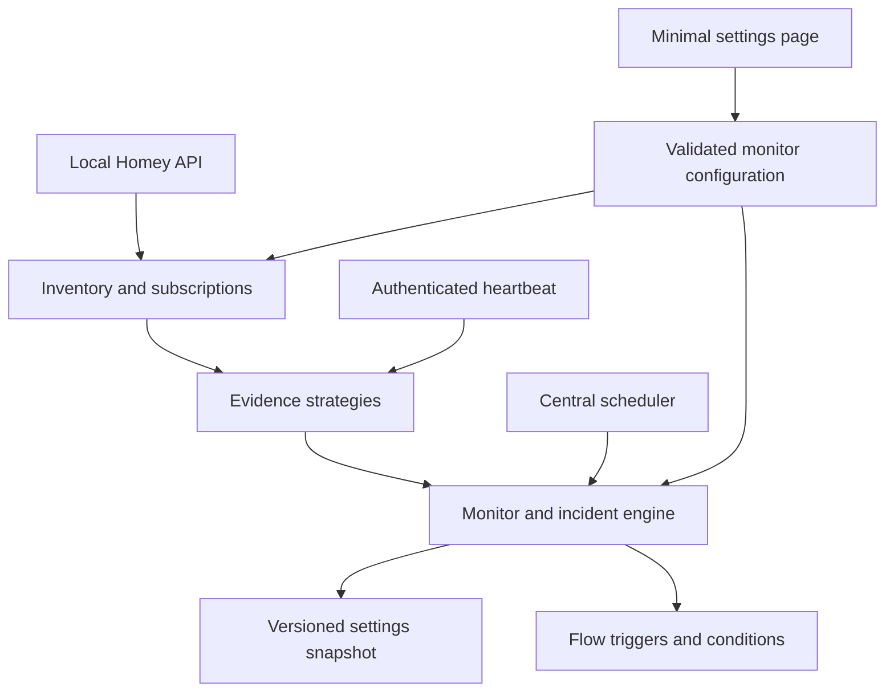

# Homey Data Watchdog — architecture decision record

Research date: 2026-09-17. Status: implementation design; no installation or experiment on a live Homey has been performed.

## Identity and supported baseline

Proposed and adopted app ID: `io.github.arrow87-home.datawatchdog`. This uses the repository owner's GitHub namespace, without claiming ownership of a separate domain. Store availability has not been checked; do that before publication. Version 0.1.0, SDK 3, `platforms: ["local"]`, Homey >=12.9.0, Node.js 22 runtime, TypeScript compiled to CommonJS. Homey CLI 4.5.0 requires Node 24 on the developer machine; that is distinct from the app runtime. No radios or hardware-specific features are needed.

## A. Findings and evidence

### 1. Can identical values prove fresh delivery?

**Not generically.** The official SDK documents `setCapabilityValue` as setting a value, without an end-to-end guarantee that every repeated source report produces a third-party event. A source driver can also discard identical readings before calling Homey. The watchdog cannot see those discarded reports.

The official `homey-api` 3.20.0 client was inspected from its npm distribution. In `lib/HomeyAPI/HomeyAPIV3/ManagerDevices/DeviceCapability.js`, the listener does not compare values. It suppresses self-generated transaction IDs and equal transaction timestamps. A received event with the same value and a different transaction time can reach the callback. **That proves client behavior only, not server emission, source origin, or upstream delivery.** Client-side writes can also update the capability and its timestamp.

Therefore ordinary capability events and `lastChanged` never automatically refresh `lastDeliveryAt`. No generic CapabilityEventStrategy is enabled. A test demonstrates the official client's same-value behavior without making any live writes.

### 2. Actual timestamps and events

| Signal                                             | Established meaning                                                                                               | Decision                                                             |
| -------------------------------------------------- | ----------------------------------------------------------------------------------------------------------------- | -------------------------------------------------------------------- |
| Capability instance `lastChanged`                  | API client initializes it from `capabilitiesObj[id].lastUpdated`; subsequent values derive from `transactionTime` | Not a universal delivery timestamp                                   |
| Capability `lastUpdated`                           | Timestamp exposed by the capability API/client                                                                    | No claim that it covers every report or only physical-source reports |
| Device `lastSeenAt`                                | SDK `setLastSeenAt()` is for an alive, responding device; available since Homey 12.6.1                            | Opt-in device-activity strategy; source must actually maintain it    |
| Explicit timestamp capability **value**            | Source-specific contract can mean successful data receipt                                                         | Preferred data-delivery strategy, with documented units and contract |
| Manual heartbeat                                   | Authenticated caller explicitly attests a successful delivery                                                     | Supported; a blind timer is not proof                                |
| `device.update`, availability, rename, app running | Metadata or administrative state                                                                                  | Inventory/diagnostics only, never a heartbeat                        |

No requirement that all installed apps call `setLastSeenAt` was found. Activity does not necessarily establish that a particular measurement was refreshed. Flow tokens include `evidence_kind` so notifications can preserve that distinction. Null/missing timestamps produce an unproven warm-up state, not HEALTHY.

### 3. Source app identity

Inventory reads `devices.getDevices()`, `apps.getApps()` and `zones.getZones()`. Local API schema includes device `ownerUri`, `driverId`, zone, capability objects and `lastSeenAt`. Use fully qualified `driverId` and cross-check an exact app owner URI. Qualified built-in manager drivers also avoid deprecated properties. If no qualified ID exists, only an own legacy `driverUri` data property is used as a lazy compatibility fallback; the current client's warning-only accessor is never invoked. Short local driver IDs can use owner identity. Conflicts are marked unresolved. System/virtual owners are preserved as separate identifiers; unknown owners are isolated per device, never grouped into one fictitious app. Names are display metadata, never keys. Uninstalled apps and removed devices do not delete saved selections.

### 4. SHS feasibility

The official SDK's Homey platform table explicitly identifies SHS and Pro 2023/mini/2026 as `local`, platformVersion `2`. `HomeyAPI.createAppAPI` selects `HomeyAPIV3Local` for exactly that combination and obtains its URL and token from SDK managers. This is a direct basis for sharing the adapter. See [the compatibility matrix](shs-compatibility.md). Installed firmware, app permissions, event behavior and lifecycle still require an authorized SHS acceptance test. Documentary support is not a live test result.

### 5–7. Strategy choice, limitations and false positives

Three explicit strategies ship: `timestamp-capability` (ISO/epoch seconds/epoch milliseconds), `device-last-seen` (activity), and `manual` (successful delivery attestation). `sourceContract` is optional documentation (default empty), not a detection rule. Timestamp fields remain an explicit user choice; a sole field of supported type is preselected in the UI after choosing a device, with source-semantics guidance. The core never infers delivery from a capability name or ordinary measurement. Timestamp strategy supports selected capabilities with **any-of** semantics: any advancing timestamp refreshes the device; this is device/source liveness, not an assertion that every field is fresh. One monitor per device prevents double counting.

Repeated timestamp snapshots, timestamp replay, backward timestamps, invalid types, and future times are ignored. Retained snapshots count at their source time, never their retrieval time. A stale timestamp cannot recover a monitor. A first heartbeat is not invented at app startup. A monitor with no first evidence eventually reports missing verified evidence, with an empty last-delivery token. Sleeping/event-only devices need an appropriate source contract and timeout or should remain unselected.

Observer loss suspends evaluation. On reconnect each monitor receives a fresh observation grace period; existing incident identity survives and fresh evidence is required for recovery. An observer fault is shown separately from source failure. Wall-clock discontinuities also suspend stale inference until a new grace period has elapsed. Availability does not refresh or invalidate good evidence by itself.

### 8. Correlation and recovery

Pure engine, one central evaluator. Defaults: scheduler 10 seconds; timestamp snapshot refresh 60 seconds; inventory metadata refresh 5 minutes; correlation window 60 seconds; minimum affected 2; affected fraction 80%; recovery fraction 90%; recovery stability 60 seconds. All tunables are centralized and validated.

At timeout a device enters SUSPECTED_STALE. Its stale boundary is last delivery + timeout, or observation start + timeout if no evidence exists. The correlation window deliberately holds back individual notifications. After it, a cohort of at least N and X% whose boundaries fit within the window starts one integration incident. Otherwise individual incidents start. Devices that fail later join an active integration incident without another alarm. Different timeout settings can produce staggered failures outside the cohort window; these remain separate until a qualifying cohort exists. This tradeoff is explicit, not a claim that every app outage can be inferred perfectly.

An integration incident records a frozen cohort of monitored device IDs at creation. New devices do not change its recovery denominator; deleted, disabled or unobservable members cannot masquerade as healthy. Configuration edits that change the monitored scope cancel affected incidents administratively, without recovery Flows. Only fresh heartbeats cause recovery. Already-sent device alerts cannot be retracted when an incident is later promoted; they are absorbed without device recovery messages.

After >=90% of the original cohort is healthy for the stability period, emit one integration recovery. Include remaining affected devices. A remaining defect becomes a device incident (one alert if it was previously suppressed); previously reported individual defects keep their identity. Flapping resets the stability period. Counts distinguish currently stale devices from all devices affected during the incident.

### 9. Permissions and security

Only `homey:manager:api`. It grants broad Homey access; the app uses it for read-only inventory and subscriptions. It does not restart apps, change devices or edit user Flows. Own settings and own registered Flow cards use SDK managers. No public API endpoints, credentials in files, API debug logging, analytics or telemetry. Authenticated heartbeat requests are attestations, not independent verification. No outbound cloud service is needed by the app; normal Homey platform services are outside its control.

## B. Components

### Domain and configuration

`MonitorConfig`: stable id, sourceAppId/name, deviceId/name, zone, strategy with capability IDs/encoding, sourceContract, expectedIntervalMs, staleTimeoutMs, enabled. Intervals are milliseconds in JSON; UI and Flow interval tokens use minutes. `WatchdogConfig` is a versioned envelope with monitors and correlation settings. Configuration is persisted separately from runtime.

`MonitorRuntime`: state, lastDeliveryAt (nullable UTC epoch ms), observationStartedAt, graceUntil, staleSince, healthySince, recoveredAt, present. `DeviceIncident`: identity and start time. `IntegrationIncident`: identity, source key, original members, affected member set, start time, recoveringSince. The engine returns immutable event payload snapshots with source/device labels, evidence type and timestamps. It keeps no unbounded history; active incidents are proportional to configured monitors.

### Persistence and event delivery

Settings adapter stores versioned config and versioned runtime separately. Runtime is checkpointed periodically and before Flow dispatch. Restored data is schema-validated, matched against detection-relevant configuration fingerprints and quarantined on invalid shape. Runtime preserves incident identities/suppression, but observation starts anew. The shutdown hook is best effort, not the sole persistence mechanism.

Homey Flow execution and settings writes are not one transaction. The implementation favors no replay storms: checkpoint first, attempt each event once, expose dispatch failures, do not blindly retry potentially executed Flows. This is **not exactly-once delivery**; a crash between checkpoint and trigger can lose an alert, and underlying settings flush guarantees remain platform-owned. A durable idempotent downstream consumer could improve this later.

### Adapter and scheduling

Small structural TypeScript interfaces wrap official API objects. Only selected timestamp capabilities get listeners. Each device has at most one listener per selected capability; unchanged listeners are reused during reconfiguration, changed/removed listeners are destroyed, and shutdown destroys all listeners. Explicit connection status plus periodic uncached snapshots detect observer problems. One scheduler coordinates evaluation and low-frequency reconciliation; no timer per monitor. Repeated inventory requests are coalesced; subscriptions are diffed. API calls are bounded, sequential or in small fixed batches, and failures do not erase inventory/configuration. Settings view refresh is user initiated.

### External SHS heartbeat (future transport)

Define an `ExternalHeartbeatSink` with payload `{schemaVersion, instanceId, bootId, sequence, sentAt, observerHealthy}`. Publish only after a completed scheduler cycle. Prefer MQTT for the existing local mqtt-core infrastructure: QoS 1, sequence deduplication, expiry/receive-age checks and Last Will. Never accept a retained heartbeat as fresh merely because a subscriber reconnects. A broker on the same mini-PC shares its failure domain; Homey Pro must independently alarm on missed arrival, including broker loss. The transport is intentionally not wired in v0.1. Authenticated local HTTP polling is a reasonable alternative but would require credentials at the external monitor. Neither approach can make an in-SHS app alert when the host itself is dead.

## Official sources

- [Platform table and timers](https://apps-sdk-v3.developer.homey.app/Homey.html)
- [Device SDK: setCapabilityValue and setLastSeenAt](https://apps-sdk-v3.developer.homey.app/Device.html)
- [Homey API in-app bootstrap](https://athombv.github.io/node-homey-api/HomeyAPI.html#.createAppAPI)
- [Official API client source](https://github.com/athombv/node-homey-api), inspected npm `homey-api@3.20.0`: `lib/HomeyAPI/HomeyAPI.js`, `HomeyAPIV3/ManagerDevices/{Device,DeviceCapability}.js`, `assets/specifications/HomeyAPIV3Local.json`.
- [Permissions](https://apps.developer.homey.app/the-basics/app/permissions)
- [TypeScript](https://apps.developer.homey.app/guides/tools/typescript), [Node 22 / Homey 12.9 baseline](https://apps.developer.homey.app/upgrade-guides/node-22)
- [Manifest](https://apps.developer.homey.app/the-basics/app/manifest)
- [Flow token types](https://apps.developer.homey.app/the-basics/flow/tokens)
- [App API and default authentication](https://apps.developer.homey.app/advanced/web-api)
- [Settings persistence](https://apps.developer.homey.app/the-basics/app/persistent-storage), [Settings manager](https://apps-sdk-v3.developer.homey.app/ManagerSettings.html), [Lifecycle](https://apps-sdk-v3.developer.homey.app/App.html)
- [SHS product and failure domain](https://homey.app/en-us/homey-self-hosted-server/)

## Configuration polish compatibility

Notes are excluded from detection fingerprints. Version-1 snapshots from before that change remain readable: normalize only the legacy per-monitor `sourceContract` key and require all other fingerprint content to match exactly. Newly saved snapshots use the note-free fingerprint. This does not relax policy/detection compatibility or the established full observation grace on process restart. In-process note-only edits preserve runtime, incident identity and recovery progress.
