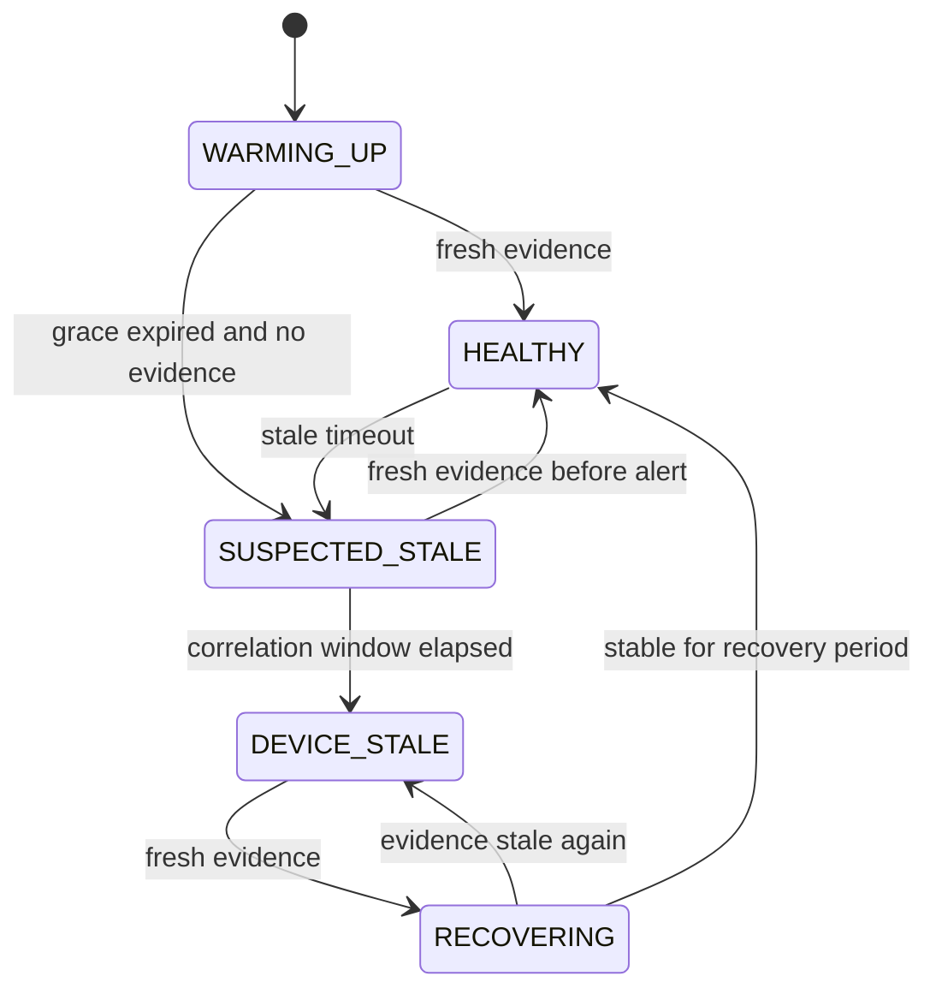
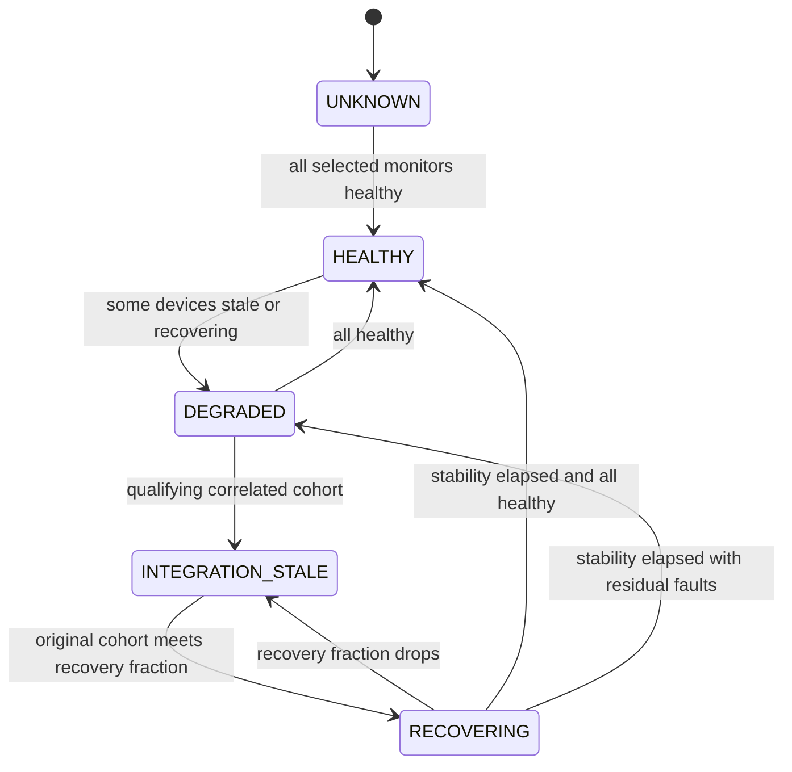

# State machines

## Device monitor

DISABLED and MISSING are administrative overlays; UNKNOWN is the observer-unavailable overlay. They do not emit recovery. Restart/reconnect preserves open incidents, resets observation grace and requires new evidence. No evidence means no fictitious lastDeliveryAt. Expected interval describes the source contract; staleTimeout (>= expectedInterval) controls alarms. Any selected timestamp can prove device liveness; separate capability health is outside v0.1.

## Integration

An incident is a separate entity from derived integration health. Integration recovery closes that incident even if one device remains broken; recovery tokens explicitly show the remainder. Individual events are held during initial correlation and suppressed while the integration incident is open. Membership growth does not trigger another start. Both specialized and `any_incident_*` Flow cards fire for one domain event; use one family for notifications to avoid double notification by user-created Flows.

## Evaluation order and edge cases

1. Validate clock and observation health; suspend if unreliable.
2. Evaluate all monitors at the same injected time.
3. Promote qualifying cohorts before any individual notification.
4. Update integration membership and recovery; retain frozen denominator.
5. Emit individual starts/recoveries only outside active integration incidents.
6. Persist resulting snapshot, then dispatch returned events.

Removed devices remain configured as MISSING. Disabling/removing/changing detection configuration cancels affected incidents administratively, without a recovery event; an audit/status view records current state. Mere renames and zone changes preserve incident identity. New inventory devices are visible but not automatically selected. A no-evidence timeout message must say that no verified heartbeat was received, rather than assert a known last-delivery time. Large scheduler gaps are treated as observer gaps to avoid false outages after a paused process.
